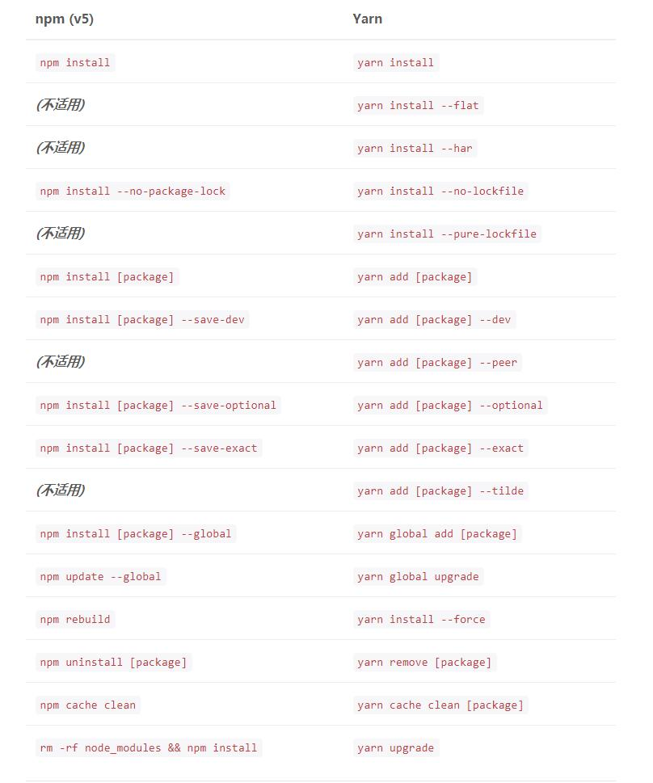

## jiathis使用方法    
```html  
<!DOCTYPE html>
<html lang="zh-cn">
<head>
    <meta http-equiv="Content-Type" content="text/html;charset=utf-8">
    <meta name="renderer" content="webkit">
    <meta http-equiv="X-UA-Compatible" content="IE=edge">
    <title></title>
    <meta name="description" content="">
    <meta name="keywords" content="" />
    <!--[if lt IE 9]>
    <script src="//cdn.bootcss.com/html5shiv/3.7.3/html5shiv.min.js"></script>
    <script src="//cdn.bootcss.com/es5-shim/4.5.9/es5-shim.min.js"></script>
    <![endif]-->
    <!--<script type="text/javascript" src="[JS library]"></script>-->
    <!--[if (gte IE 6)&(lte IE 8)]>
    <script type="text/javascript" src="src/selectivizr.js"></script>
    <noscript><link rel="stylesheet" href="[fallback css]" /></noscript>
    <![endif]-->
</head>
<body>

<header class="">
    <div class="">
        <!-- JiaThis Button BEGIN -->
        <div class="jiathis_style">
            <span class="jiathis_txt">分享到：</span>
            <a class="jiathis_button_tools_1"></a>
            <a class="jiathis_button_tools_2"></a>
            <a class="jiathis_button_tools_3"></a>
            <a class="jiathis_button_tools_4"></a>
            <a href="http://www.jiathis.com/share" class="jiathis jiathis_txt jiathis_separator jtico jtico_jiathis" target="_blank">更多</a>
            <a class="jiathis_counter_style"></a>
        </div>

        <!-- JiaThis Button END -->
    </div>
</header>

<script type="text/javascript" src="//cdn.bootcss.com/jquery/1.12.4/jquery.min.js"></script>
<script>
    $(function () {
        window.jiathis_config = {
            url:"自定义地址",
            title:"自定义标题!",
            summary:"自定义内容",
        }
    })
</script>
<script type="text/javascript" src="http://v3.jiathis.com/code/jia.js" charset="utf-8"></script>
</body>
</html>
```   
*jiathis自定义的使用方法在官网是有的，但官网给的是定义一个jiathis_config的变量，这种写法导致分享出去无法显示自定义的数据，正确做法如上,
window.jiathis_config,只有这样写才回成功分享*  


## 资源安装工具  
*node之前使用的安装工具一直是npm，但npm的服务器搭在国外，国内使用npm速度太慢，虽然有淘宝的cnpm镜像，但在速度上依然不够出色，目前一款名为“Yarn”的下载工具，下载速度很出色，至少要比cnpm出色，用法基本上和npm相同*  
-参考地址:https://yarnpkg.com/zh-Hans/  
-部分参数：  

